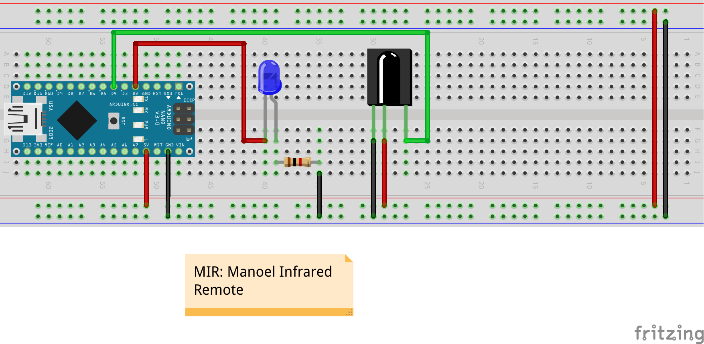
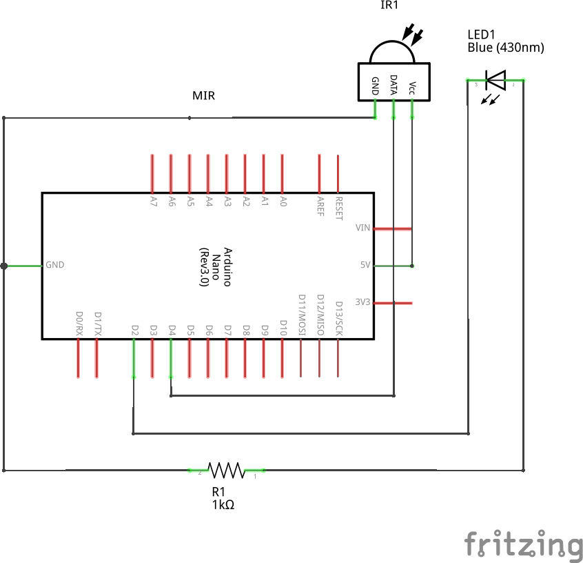

<p align="center"></p>

# mir

This project describe a simple Infrared Remote Control for a Personal
Computer made using a AVR Microncontroller as Arduino Nano and a
interpreter of IR signals written in Python communicating via serial.

# Schematics of the receiver






# Remote Controller

I use a Sky controller model D40 for my application.


# Usage / Instructions

1. Mount the schematics circuit as described in this repository
2. Compile the program of the microcontroller at IRController on the firmware
3. Plug the Arduino on the USB and run the following instructions:

```
git clone git@github.com:ryukinix/mir.git
cd mir
python -m venv venv
source venv/bin/activate
pip install -r requirements.txt
./server

```

After that, you can use the D40 controller as your personal computer
remote control.
